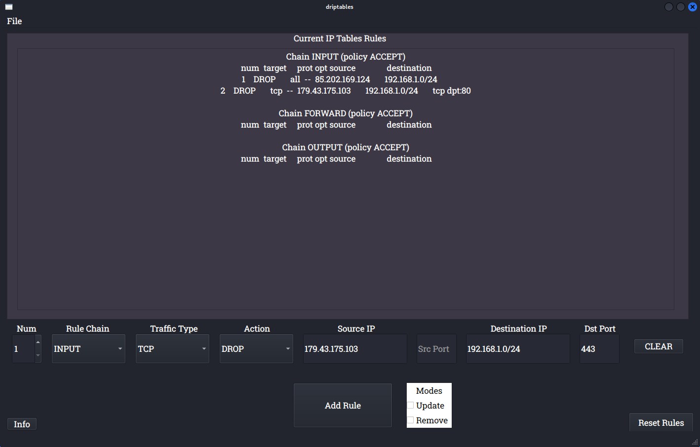

# driptables

A GUI version of iptables, created with Python and PyQt5




## Description 

Driptables simplifies the configuration and maintenance of firewall rules in Linux. Individual rules can be added, removed, changed, and updated. All rules and rules under selected chains can be flushed, and rules can be saved to a file or restored.

## Prerequisites

```
sudo apt-get update
```
```
sudo apt-get install python3.9
```

To run both of the above:

```
sudo bash -c "$(wget -nv -O - https://github.com/jchi4/driptables/raw/main/quick.sh)"
```

## Additional Packages

iptables-persistent and netfilters-persistent will autosave your firewall configuration.

```
sudo-apt-get install iptables-persistent netfilter-persistent
```


## Installation and Usage (for linux):


To load all prerequisites, additional packages, and driptables:

```
sudo bash -c "$(wget -nv -O - https://github.com/jchi4/driptables/raw/main/full.sh)"
```

To download the program only:
```
wget https://github.com/jchi4/driptables/raw/main/driptables.py
```

## Capstone Documents

[Project Proposal](https://github.com/jchi4/driptables/blob/main/documentation/Firewall%20GUI%20Proposal.pdf)

[Proof of Concept](https://github.com/jchi4/driptables/blob/main/documentation/Proof%20of%20Concept.pdf)

## License

[MIT](https://github.com/jchi4/driptables/blob/main/LICENSE)
